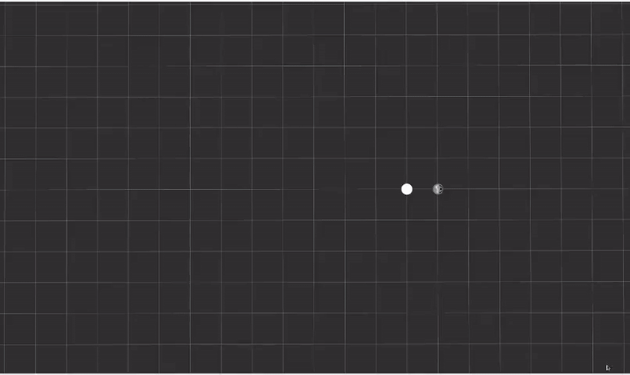
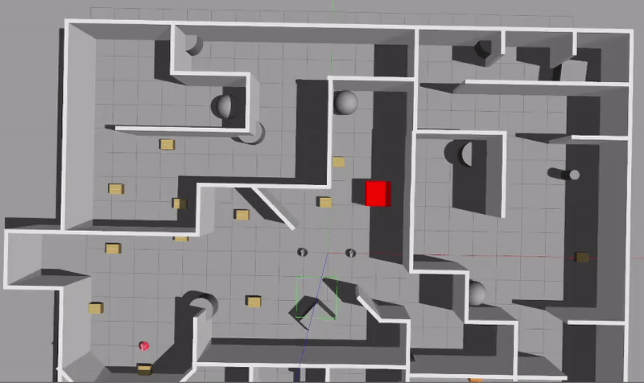

# Tu Many Robots @TUM
---


```
Two capable robots are spawned into an unknown world.  
They must locate the exit, as well as a blind robot, i.e. without visual sensors.    
They must guide the blind robot to the exit.   
```

<table style="margin-left: auto; margin-right: auto; table-layout: fixed; width: 100%">
  <tr>
    <td style="width: 50%;"> </td>
    <td style="width: 50%;"> </td>
  </tr>
  <tr>
    <td style="width: 50%;"> </td>
    <td style="width: 50%;"> </td>
  </tr>
</table>

---
### System Prerequisites
This project was built with   
- ROS Noetic on Ubuntu 20.04.
- NVIDIA GPU **

** This computer vision pipeline requires a Nvidia GPU. However, a mock of the pipeline is made so that the project can be run without it. Testing was done with an NVIDIA 2060 Super with a AMD Ryzen 7 3700X. As the simulation runs 3 robots and 2 visual pipelines the visualization of results is computationally expensive and affects performance while running the complete system.

---

### Install
</br>
This project is an extension of an existing repository for robotino robots.
To install these dependencies, first run the install_script.bash from a suitable catkin directory. This completely installs all the needed packages to run a minimal working version of the project.
</br>
</br>

The vision module additionally requires following the README within tmb_perception package. By default, the mock is used. Attempting to build the vision module without installing the dependencies will fail. Hence, **blacklist** the darknet_ros package

---
### Build

```
cd <your catkin workspace>

catkin config --blacklist darknet_ros
catkin build
source devel/setup.bash
source src/TU_Many_Bots/config_script.bash
```


Sourcing the config_script will give a printout of the options available
as well as the currently active setup.

```
-------------------------------------------------------------
TU Many Bots configuration
-------------------------------------------------------------
tmb_ROBOT_ENV: [simple_corridor, maze, maze_simple, maze_simple_2, maze_clutter, maze_clutter_limited]
tmb_start_both: [true, false]
tmb_publish_perception_logs: [true, false]
-------------------------------------------------------------
selected world is: simple_corridor
starting both robots: True
publishing perception logs: False
with predicting yaw: False
-------------------------------------------------------------

```
eg. change the map with ``export tmb_ROBOT_ENV=simple_corridor``

---

## Run

The most important commands to get the simulation to start:
```
roslaunch tmb_startup complete_launch.launch
```

Todo: include running scripts for vsion module

--- 

## How it works
@@ Picture of the nodes

We use a multitude of prebuilt and custom nodes and packages to accomplish our goal specified in the introduction.

@@ Visualization of packages

## Overall explanation


---
### ***Perception***

</br>
</br>
The perception module answers the question:  

> "*What the guiding robots tells us about the blind robot*"


It is a **pipeline** consisting of:
- Detecting the blind robot with a camera -> bounding boxes
- Synthesizing the bounding box + laser sensor data -> relative position
- Combining the relative position + known position of detecting robot -> absolute position
- Using this position estimate + as well as velocity input -> bearing


Within the simulation, the bearing and absolute location of the blind robot is known.
Not only doe this mean that we can bypass the entire pipeline, we have also isolated each step of the pipeline.

This can be done by creating a **mock** of step.

The bounding box is mocked by assuming a span of vision from the camera sensor
and only publishing the detected position if we could realistically have expected the robot to have seen the blind robot.

Mocking the interpretation of the bounding box is done by publishing the exact blind robot location as soon as the computer vision model did detect it.

Mocking the yaw is done by passing through the known yaw, instead of the computed yaw.

Whether any steps of the pipeline are mocked during execution can be toggled by setting
and combination of the following environment variables to true

> tmb_with_camera_detection   
> tmb_with_bounding_box_interpretation  
> tmb_with_computed_yaw

by isolating each step, and having the expected value available, is is thus able
to independently test each step, and also to compare the accuracy of each step.


#### Bounding Box Interpreter
This node makes sense of the information received from bounding boxes.
  Notably, it predicts the distance, and rough bearing estimate of the detected object.

  The laser scans in a wide span around the robot.
  Those that overlap with the camera feed are synthesized and scaled
  from [ 0 to 1 ] corresponding to far left and far right of the camera feed.

  The location of the bounding box within the camera frame is likewise scaled.
  The distance of the object is thus predicted from taking the scans which relate
  to the bounding box.

#### Target Distance Detector

As an interface

  This node processes the information from the perception module and makes predictions
  about the location of detected objects. However, to keep the perception pipeline as a
  detachable module it also provides an opportunity to simulate (mock) the camera module.
  Regardless, the following is published:


As a mock

  Taking properties from the camera itself, as well as the known robot positions
  it is estimated whether the camera "would" otherwise be able to detect the object.
  In this case, we publish the information which that robot would be expected to see.
  ie, if it rotates out of the line of sight of the target, publishing stops.


As an estimator

  Using the information from the bounding box,
  and the known information about the robot itself, form an estimation of the
  location of the spotted target.Using this position estimate, as well as velocity input, to determine bearing.


#### Pose Resolver
This node acts as in interface for the following and guiding routines.
Notably, while some robots can see and we have good information,
others, such as the blind robots, have no sensors and we have to
compute an estimate of their yaw.

Regardless of the class, this outputs a Computed_Pose

Information used
</br>
</br>
        Global position estimates received from the guiding robot
        Input velocities provided to the blind robot
        </br>
        </br>
Application:
</br>  
      computed_translation: unit vector of movement in global frame
      computed_velocity: unit vector of linear velocity in robot local frame
      displacement: angular rotation in radians
      </br>
      </br>
      The bearing of the robot is determined as the difference between
      the expected translation from the local frame and the actual translation observed.
      </br>
      </br>
      As the robot can also rotate independently, angular displacement is also considered.

---
### SLAM
For Simultaneous Localization and Mapping (SLAM) we use the standard gmapping package. Configuration files are in the config folder in the tmb_communication package. Gmapping was chosen over the slam-toolbox online async algorithm after evaluating both algorithms in testing. Even after including more cluttering to the maps, the toolbox still had trouble providing twist free maps and it was also getting lost during loop closures. Gmapping has the distinct advantage that our map merge algorithm works best with maps with fixed sizes which are provided by gmapping. With map merging we are able to compute an overall map which gets explored by both robots where we can locate the blind robot in.

### Path Planning
Path planning works in two different phases. First we explore the environment by finding unknown space and creating frontiers, this is done by the explore-lite package. We then publish a goal while trying to explore the biggest frontiers. The path is computed by the move_base package by computing a global costmap on the robot maps and then utilizing the laser sensors to perceive the immediate environment and adjust to dynamic obstacles through the local costmap.

After perceiving the goal, the blind robot and being able to compute a path. We switch to the guiding routine which disables the exploration and allows the robots to move to the blind robot and guide it to the goal. The path planning works similarly like before but the goal publishing nodes change.

### Guiding routine
@@

## SLAM
We use gmapping (http://wiki.ros.org/gmapping) with a largely base setup. We changed the parameters so the map gets updated at a rate of 1Hz. Space over 5 meters away gets classified as unknown space which allows to compute frontiers in exploration. Configuration is specified in the tmb_communication package under config. 

## map_merge
We use the multirobot_map_merge package provided by (http://wiki.ros.org/multirobot_map_merge). This allows us to merge maps where the robot start positions are known. In theory the algorithm is also able to compute maps without knowing the start positions of the robot. This did not work in practice but we could overlay with known starting positions anyway. For known start positions the maps get overlayed. This means that deviations in SLAM lead to large deviations in the computed merged map. So a good SLAM is crucial for this to work properly.

## exploration
We use the explore_lite package provided by http://wiki.ros.org/explore_lite. This is developed by the same developer as the multirobot_map_merge package we explained previously. The only adjustments to the algorithm are a change in topics and increasing the timeout period so frontiers get only classified as unreachable after a longer period of time. The algorithm tracks unknown space in the provided map to compute frontiers. Then by finding the biggest frontier, a goal is published on the specified topic and then we use move_base to travel to that frontier. Map updates lead to new frontiers, which will then impact the computed goal so the biggest frontiers get explored first in a greedy approach. Drawbacks of this approach can be found when looking at time needed to explore a complete space, since only the biggest frontiers get explored, newly found frontiers in the vicinity of the robot get explored at a later time. 

## move_base

## position listener

## following routine

## robot_state_publisher

# API

=======
# Possible further development

- Multi robot exploration algorithm to explore the map in a more distributed fashion
- Update merged map directly after robots localize themselves in it
- Introduce possibility to start from unknown positions 
- Improve durability of system
- Introduce automatic error handling for more sustainable performance in long scenarios
